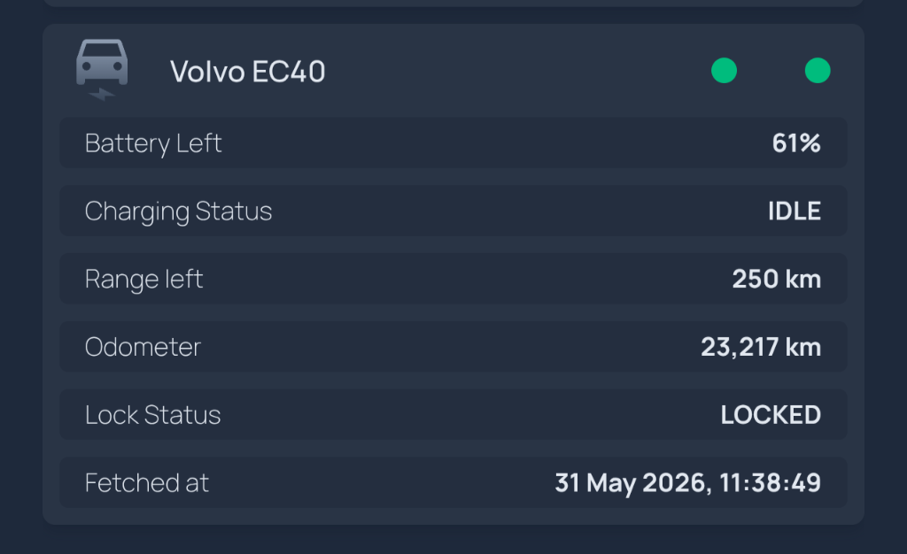

# volvo-dashboard

Small Flask service that talks to the Volvo Connected Vehicle + Energy APIs
and exposes `GET /status` with battery, charging, lock, and range. Designed
to feed a [Homepage](https://gethomepage.dev) `customapi` widget running on
a NAS.

## How authentication works (`token.json`)

Volvo's APIs don't accept a username/password. Everything hangs off an
OAuth2 **refresh token** that you obtain once, interactively, and then store
on disk in `token.json`. Understanding this file is the key to keeping the
service alive long-term.

### The credentials, and what each is for

| Credential | Where it lives | Role |
|---|---|---|
| `VCC_API_KEY` | `.env` | Per-app API key sent as the `vcc-api-key` header on every Volvo API call. Identifies your *application*. |
| `VOLVO_CLIENT_ID` / `VOLVO_CLIENT_SECRET` | `.env` | OAuth2 client credentials. Used as HTTP Basic auth when exchanging codes/refresh tokens at the token endpoint. |
| `refresh_token` | `data/token.json` | The long-lived grant that proves *a user authorized this app*. Exchanged for short-lived access tokens on demand. |
| `access_token` | in-memory only | Short-lived (~30 min) bearer token actually sent to the API. Never written to disk; cached in the process and refreshed automatically. |

### The token lifecycle

```
authorize (once, browser)          runtime (every ~30 min, headless)
─────────────────────────          ─────────────────────────────────
 you log in at volvo.com                 read refresh_token
        │                                from data/token.json
        ▼                                        │
 authorization code                              ▼
        │  + PKCE verifier              POST /token (grant_type=
        ▼     + client secret                 refresh_token)
 POST /token (grant_type=                       │
   authorization_code)                          ▼
        │                              new access_token  (kept in memory)
        ▼                              new refresh_token (rotated!)
 first refresh_token  ───────────►            │
 written to token.json                        ▼
                                     data/token.json REWRITTEN
```

What `token.json` looks like — a single JSON object, nothing more:

```json
{ "refresh_token": "eyJ...rotates-on-every-use..." }
```

### Rotation — why the file is precious

Volvo issues a **new refresh token on every `/token` exchange** and
invalidates the old one. The service writes the fresh value back to
`data/token.json` after each access-token refresh (see
`_save_refresh_token` in `volvo_client.py`). Practical consequences:

- **The file is stateful, not a static secret.** Restoring an old backup of
  `token.json` hands Volvo a token it has already retired → every call then
  fails with `400 invalid_grant`, and you must re-run `authorize`.
- **Run exactly one instance per token file.** Two processes (or a stale
  container that wasn't fully removed) racing on the same `data/` mount will
  each rotate the token out from under the other, breaking both.
- **The `data/` volume must be persistent.** It's what carries the rotating
  token across container recreates and image updates. Lose the volume → lose
  the token → re-authorize.
- **Expiry from disuse.** If no refresh happens for a long stretch (weeks),
  Volvo can expire the refresh token entirely. The fix is always the same:
  re-run `authorize` to mint a fresh one. Because the running service
  refreshes every ~30 min, an actively-polled deployment effectively keeps
  itself alive.

### Re-authorizing (rotating manually / recovering)

Whenever the token is lost, expired, or you want to start clean:

```powershell
$env:VOLVO_TOKEN_FILE = "./data/token.json"
python volvo_client.py authorize   # opens a browser, you log in once
```

This overwrites `data/token.json` with a brand-new refresh token. Copy that
file back to the host volume (see the deploy sections) and restart the
container. To revoke the grant entirely, go to volvo.com → Connected
Services; the next refresh attempt will then fail until you re-authorize.

> **Security note:** `token.json` and `.env` are git-ignored on purpose —
> never commit them. The refresh token is a bearer credential for your car's
> data; treat the `data/` directory like a password file (restrict
> permissions, don't sync it to anything public).

## First-time setup (local)

1. Register an application at the [Volvo Developer Portal](https://developer.volvocars.com/)
   to get a **VCC API key**, **OAuth client id/secret**, and to set a
   **redirect URI** (default here: `http://localhost:4000/callback`).
   Enable these scopes on the app: Connected Vehicle API (doors, lock,
   battery, odometer, fuel) and Energy API.
2. Copy `.env.example` to `.env` and fill in VIN, VCC API key, OAuth client
   id/secret, redirect URI.
3. Create a refresh token (opens a browser):
   ```powershell
   $env:VOLVO_TOKEN_FILE = "./data/token.json"
   python volvo_client.py authorize
   ```
   The token lands in `data/token.json`. Keep it — it rotates on every use.

### Volvo references

- [Developer Portal](https://developer.volvocars.com/) — app registration, API keys, scope selection
- [Connected Vehicle API](https://developer.volvocars.com/apis/connected-vehicle/v2/overview/) — doors, lock, odometer, fuel endpoints
- [Energy API](https://developer.volvocars.com/apis/energy/v2/overview/) — battery %, charging status, electric range
- [Authentication (OAuth2 + PKCE)](https://developer.volvocars.com/apis/docs/authentication/) — auth/token URLs, scopes, token lifetime

## Rebuild and push to Docker Hub

Multi-arch build (covers Intel and ARM NAS):

```powershell
docker buildx build `
  --platform linux/amd64,linux/arm64 `
  -t snarkbe/volvo-dashboard:latest `
  --push .
```

Add a versioned tag when you want a rollback point:

```powershell
docker buildx build `
  --platform linux/amd64,linux/arm64 `
  -t snarkbe/volvo-dashboard:latest `
  -t snarkbe/volvo-dashboard:0.1.1 `
  --push .
```

One-off setup per machine:

```powershell
docker login -u snarkbe
docker buildx create --use --name multiarch 2>$null
```

## Deploy — manual Docker

Copy `data/token.json` and `.env` to the host volume first, then:

```bash
docker pull snarkbe/volvo-dashboard:latest
docker rm -f volvo-dashboard
docker run -d --name volvo-dashboard \
  -p 8080:8080 \
  -v /volume1/docker/volvo-dashboard/data:/app/data \
  --env-file /volume1/docker/volvo-dashboard/.env \
  snarkbe/volvo-dashboard:latest
```

The `data` mount preserves the rotating refresh token across recreates.

## Deploy — Unraid

Configured via the Docker tab in the Unraid WebUI — **Add Container**:

- **Repository**: `snarkbe/volvo-dashboard:latest`
- **Network Type**: Bridge (or your preference)
- **Port**: host `8080` → container `8080`
- **Path**: host `/mnt/user/appdata/volvo-dashboard/data` → container `/app/data`
  (preserves the rotating refresh token across container updates)
- **Variables** (one per env var from `.env.example`): `VOLVO_VIN`,
  `VCC_API_KEY`, `VOLVO_CLIENT_ID`, `VOLVO_CLIENT_SECRET`,
  `VOLVO_REDIRECT_URI`

Before first start, copy `data/token.json` from your dev machine into
`/mnt/user/appdata/volvo-dashboard/data/` on the NAS (authorize can't run
headless). After a new image is pushed, hit **Force Update** on the
container to pull `:latest` and recreate.

## Homepage widget snippet



```yaml
- Volvo EC40:
    icon: mdi-car-electric
    server: my-docker
    container: VolvoAPI
    widgets:
      - type: customapi
        url: http://192.168.0.8:11080/status
        refreshInterval: 30000
        display: list
        mappings:
          - field: battery_pct
            label: Battery Left
            format: percent
          - field: charging_status
            label: Charging Status
            format: text
          - field: range_km
            label: Range left
            suffix: "km"
          - field: locked
            label: Lock Status
            format: text
          - field: fetched_at
            label: Fetched at
            format: date
            locale: en-GB
            dateStyle: medium
            timeStyle: medium
```

## Diagnostic CLI

```powershell
python volvo_client.py token      # print a fresh access token
python volvo_client.py vehicles   # list vehicles on this account
python volvo_client.py scopes     # show scope/aud/sub from the access token
python volvo_client.py raw /connected-vehicle/v2/vehicles/$env:VOLVO_VIN/doors
```

## Notes

- Token rotation, persistence, and recovery are covered in detail under
  [How authentication works (`token.json`)](#how-authentication-works-tokenjson).
  The short version: rotates on every call, keep the `data/` volume, run one
  instance per token file, re-run `authorize` if it expires.
- Revoke access any time at volvo.com → Connected Services.
